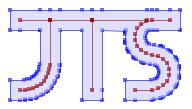

JTS Topology Suite — Kotlin Multiplatform Port
==============================================

The JTS Topology Suite is a library for creating and manipulating vector geometry.



## About this port

This project is a **faithful language port of [JTS 1.20.0](https://github.com/locationtech/jts) from
Java to Kotlin Multiplatform**. It is not a fork or a redesign: the goal is behaviour identical to
upstream JTS, with the same public types and the same `org.locationtech.jts.*` package names, so
that existing JTS knowledge and documentation carry over directly.

For everything conceptual — what the library does, the geometry model, algorithms, the FAQ, and the
API reference — please see the **original project: <https://github.com/locationtech/jts>**. This
README covers only what is specific to the Kotlin port: how to depend on it, and where its API
deviates from upstream.

Supported targets: **JVM** (Java 8+), **JS** (Node/browser), **Wasm/JS**, and **Kotlin/Native**
(macOS, iOS, Linux, Windows).

> **How this port was made.** The Java→Kotlin conversion was carried out almost autonomously by
> Anthropic's [Claude Code](https://claude.com/claude-code) (Claude Opus), under the direction of the
> maintainer, who set the strategy and made the key decisions. The translation was kept faithful by
> compiling the Kotlin against JTS's own **unmodified Java test suite** at every step — the same
> 2100+ tests upstream uses — so the ported code is validated against the original as its reference.

## Using it

Artifacts are published under group `de.mpmediasoft.kts`, version `1.20.0.0` (the 4th component is
the port revision against JTS `1.20.0`). The library is modular — depend only on what you need:

| Gradle project | Artifact | Contents |
| --- | --- | --- |
| core | `kts-core` | Geometry model, spatial predicates, overlay, buffer, algorithms, **WKT/WKB writers** |
| WKT/WKB IO | `kts-io-wkt` | `WKTReader`, `WKBReader`, `WKBWriter` |
| GML IO | `kts-io-gml` | `GMLReader`, `GMLWriter` |
| KML IO | `kts-io-kml` | `KMLReader`, `KMLWriter` |
| GeoJSON IO | `kts-io-geojson` | `GeoJsonReader`, `GeoJsonWriter` (via kotlinx-serialization) |
| File IO | `kts-io-files` | `WKTFileReader`, `WKBHexFileReader` (via kotlinx-io) |

**Kotlin Multiplatform / Gradle** — depend on the root artifact; Gradle Module Metadata resolves the
right per-target variant automatically:

```kotlin
dependencies {
    implementation("de.mpmediasoft.kts:kts-core:1.20.0.0")
    implementation("de.mpmediasoft.kts:kts-io-wkt:1.20.0.0") // optional, for WKT/WKB parsing
}
```

**Plain JVM (Gradle or Maven)** — use the `-jvm` artifacts (`kts-core-jvm`, `kts-io-wkt-jvm`, …).

> The artifacts are not on Maven Central yet. To try them now, install to your local Maven
> repository with `./gradlew publishToMavenLocal` and add `mavenLocal()` to your `repositories`.

**Example (Kotlin):**

```kotlin
import org.locationtech.jts.io.WKTReader
import org.locationtech.jts.io.WKTWriter

val geom = WKTReader().read("POLYGON ((0 0, 1 0, 1 1, 0 1, 0 0))")

// The ported types keep JTS's explicit Java getters (getArea(), getCentroid(), …):
println(geom.getArea())                              // 1.0
println(WKTWriter().write(geom.getCentroid()))       // POINT (0.5 0.5)
println(WKTWriter().write(geom.buffer(0.25)))        // POLYGON ((...))

// …and an additive extension-property layer restores the Kotlin `.property` idiom you'd get from the
// Java JTS artifacts. Import it (`import org.locationtech.jts.geom.*`) and write:
println(geom.area)                                   // 1.0
println(WKTWriter().write(geom.centroid))            // POINT (0.5 0.5)
```

## Deviations from the original API

The port is faithful, but making the code multiplatform (removing the JDK dependency) required a
small number of deliberate, documented changes. The notable ones for consumers:

- **IO is split into separate modules.** In upstream JTS the readers/writers live in `jts-core`.
  Here, the **WKT/WKB writers stay in `kts-core`**, but the **readers and the GML/KML/file IO move
  to the à-la-carte `kts-io-*` modules** above, so a geometry-only user pulls zero IO dependencies.
- **Java serialization is removed.** No type implements `java.io.Serializable`; there are no
  `serialVersionUID` fields. Use WKT/WKB for persistence.
- **`Cloneable` / `clone()` is removed** from the multiplatform surface. Use the existing
  runtime-type-preserving **`copy()`** methods instead (`clone()` was already deprecated upstream).
- **Stream-based (`java.io`) IO is JVM-only.** The common API reads/writes `String` and `ByteArray`;
  the `Reader`/`Writer`/`InputStream` overloads are provided as **JVM-only extension functions**
  (e.g. `WKTReaderExtensions.read(reader)`), since `java.io` types cannot exist in common code.
- **GML: breaking SAX API change.** `GMLHandler` is no longer a SAX `DefaultHandler`, and
  `GMLReader.read` throws `ParseException` instead of `SAXException`/`ParserConfigurationException`.
- **GeoJSON: JSON backend swapped.** The reader/writer are built on `kotlinx-serialization-json`
  instead of the JVM-only `org.json.simple`. The public API (`GeoJsonReader`/`GeoJsonWriter`) is
  unchanged; exact JSON output matches upstream on the JVM, where `GeoJsonWriter.formatOrdinate`
  renders ordinates via `Double.toString` (whole-number rendering can differ on JS/native).
- **Dropped, JVM-desktop-only pieces:** the `org.locationtech.jts.awt` package (AWT `Shape`
  conversion) and the internal dev/debug helpers (`Debug`, `TestBuilderProxy`).
- **Removed configuration hooks:** the `jts.overlay` / `jts.relate` system-property switches
  (the default implementations are used unconditionally).
- **Coordinates & names:** artifacts use group `de.mpmediasoft.kts` and `kts-*` artifact ids to
  avoid any clash with the upstream `org.locationtech.jts` Java artifacts. **Source package names
  are unchanged** (`org.locationtech.jts.*`).

The complete, itemised list — including internal changes and the rationale for each — is in
[`doc/kotlin/KOTLIN-MP-COMPATIBILITY.md`](doc/kotlin/KOTLIN-MP-COMPATIBILITY.md).

## License

Like upstream JTS, this port is dual-licensed under:

* [Eclipse Public License 2.0](https://www.eclipse.org/legal/epl-v20.html) — see [`LICENSE_EPLv2.txt`](LICENSE_EPLv2.txt)
* [Eclipse Distribution License 1.0](https://www.eclipse.org/org/documents/edl-v10.php) (a BSD-style license) — see [`LICENSE_EDLv1.txt`](LICENSE_EDLv1.txt)
